<div align="center">

# Island

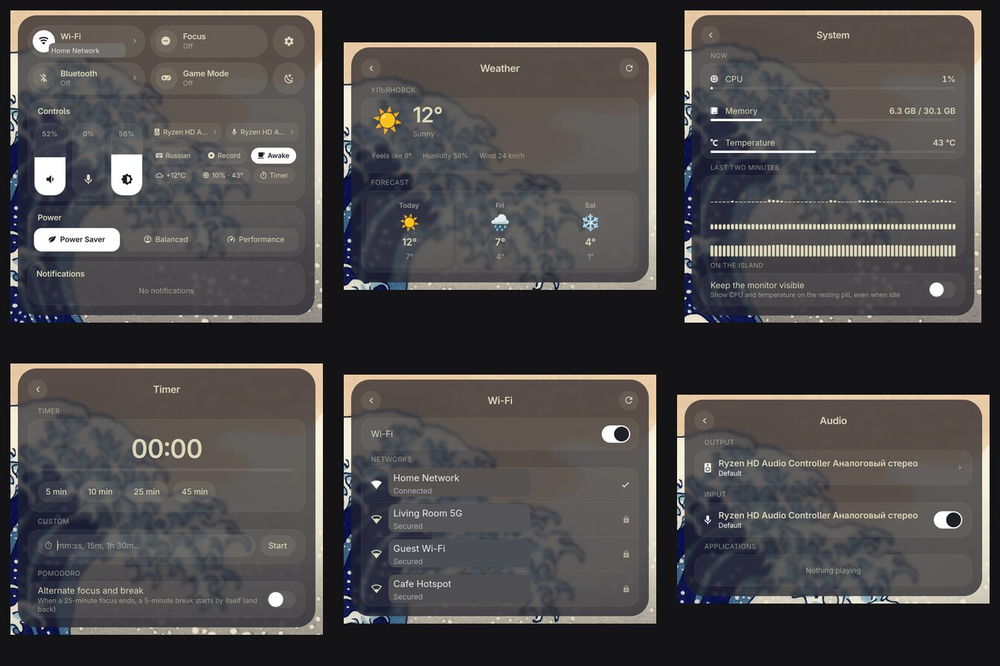

### A dynamic island for Omarchy

Omarchy's menus and status, rewritten as one fluid island that morphs between views.

[Features](#features) · [Screenshots](#screenshots) · [Install](#install) · [Usage](#usage) · [Uninstall](#uninstall)

</div>

## Features

- **At rest:** a clock, or album art with an animated sound wave while music plays.
- **Control center:** a compact panel with Wi-Fi, Bluetooth, Focus and Game Mode
  tiles (drag one onto another to rearrange them, drag its right edge to make it
  wide), output/input/volume sliders, the active output and input devices, the
  keyboard layout, screen recording, an idle inhibitor, night light, the battery,
  a weather chip, the timer and the power profile — all in one place.
- **Connectivity:** real Wi-Fi and Bluetooth pages. Wi-Fi lists nearby networks
  sorted connected/saved/by signal and joins them (with a password field when
  needed); Bluetooth splits devices into Connected / My Devices / Available,
  shows battery where the device reports it, and pairs, connects or forgets them.
- **Audio:** an Audio page with the output and input devices, per-application
  streams, and quick controls for the microphone.
- **System monitor:** CPU, memory and temperature with a live two-minute graph,
  plus a toggle that keeps the monitor on the resting pill.
- **Weather:** current conditions and a three-day forecast.
- **Calendar:** a month view behind the clock.
- **Timer:** countdowns with presets, a custom duration, and a Pomodoro mode that
  alternates focus and break; a live activity stays on the pill while it runs.
- **Live activities:** browser downloads, system updates (pacman, yay, paru and
  Omarchy updates), timers and anything you copy show up on the pill.
- **Live feedback:** notification previews, and animated volume, mute and
  brightness on-screen displays drawn by the island itself.
- **Ask AI:** type a question in the launcher and Claude or Codex answers right
  in the island, Siri-style, using the command-line tool you're already signed
  in to.
- **Expanded views:** the control center, player, app launcher, clipboard
  history, emoji and keybinding search, theme and wallpaper switchers, the
  Omarchy menu, and the power menu.
- **Shelf:** park files, links and text on the island by dragging them in;
  click a tile to copy it back, drag it out into another app, right click it for
  its actions, and `Ctrl+click` to move several at once.
- **Personalization:** text and accent colours follow your current Omarchy theme,
  with a warmth slider for the night light and frosted-glass surfaces.
- **Settings:** a pane in the control center for animation speed, a MacBook notch
  style, the clock, live activities, the AI, and About/Reset.

Island runs inside Omarchy's Quickshell process and reserves no screen space.

## Screenshots

### The island

<table>
  <tr>
    <td width="50%" align="center"><strong>Now playing</strong><br></td>
    <td width="50%" align="center"><strong>At rest</strong><br></td>
  </tr>
</table>

### Control center

<table>
  <tr>
    <td align="center">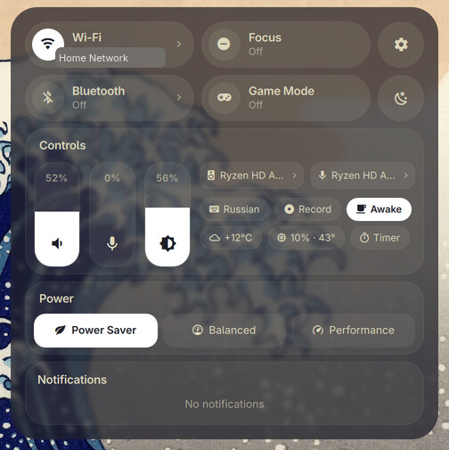</td>
  </tr>
</table>

### Monitoring

<table>
  <tr>
    <td width="50%" align="center"><strong>System monitor</strong><br>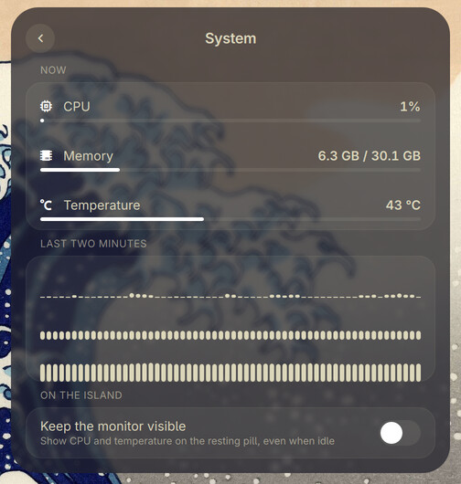</td>
    <td width="50%" align="center"><strong>Timer</strong><br>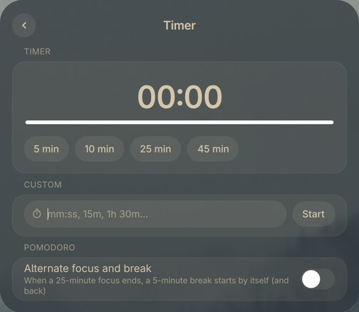</td>
  </tr>
</table>

### Connectivity and audio

<table>
  <tr>
    <td width="33%" align="center"><strong>Wi-Fi</strong><br>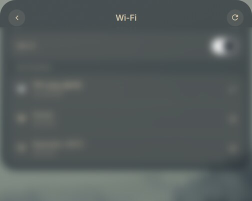</td>
    <td width="33%" align="center"><strong>Bluetooth</strong><br>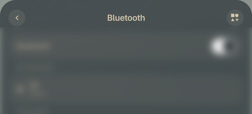</td>
    <td width="33%" align="center"><strong>Audio</strong><br>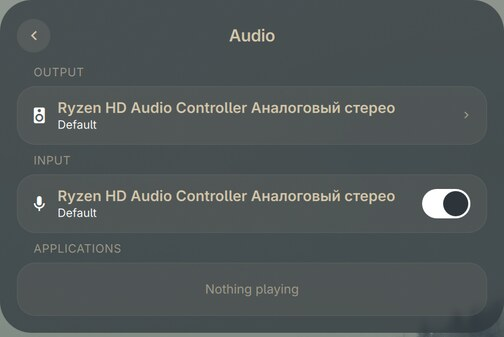</td>
  </tr>
</table>

### Weather and calendar

<table>
  <tr>
    <td width="50%" align="center"><strong>Weather</strong><br>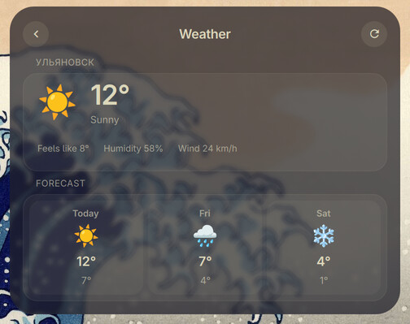</td>
    <td width="50%" align="center"><strong>Calendar</strong><br>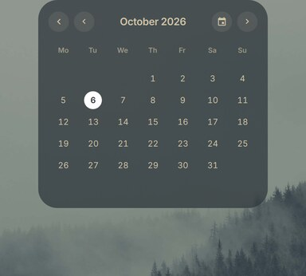</td>
  </tr>
</table>

### Player and launcher

<table>
  <tr>
    <td width="50%" align="center"><strong>Player</strong><br>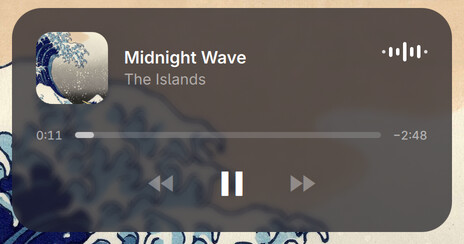</td>
    <td width="50%" align="center"><strong>App launcher</strong><br>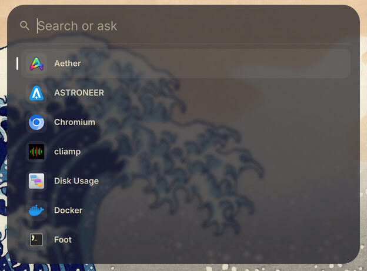</td>
  </tr>
  <tr>
    <td colspan="2" align="center"><strong>Omarchy menu</strong><br>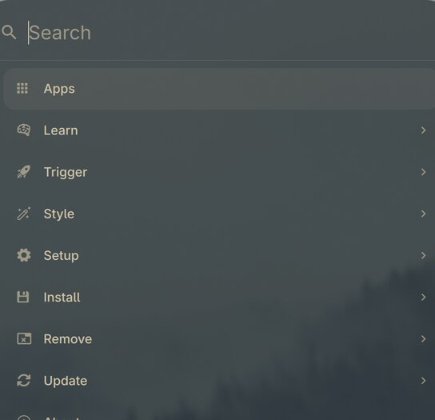</td>
  </tr>
</table>

### Search

<table>
  <tr>
    <td width="50%" align="center"><strong>Emoji</strong><br>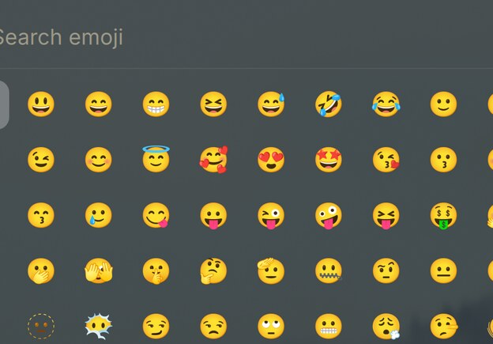</td>
    <td width="50%" align="center"><strong>Keybindings</strong><br>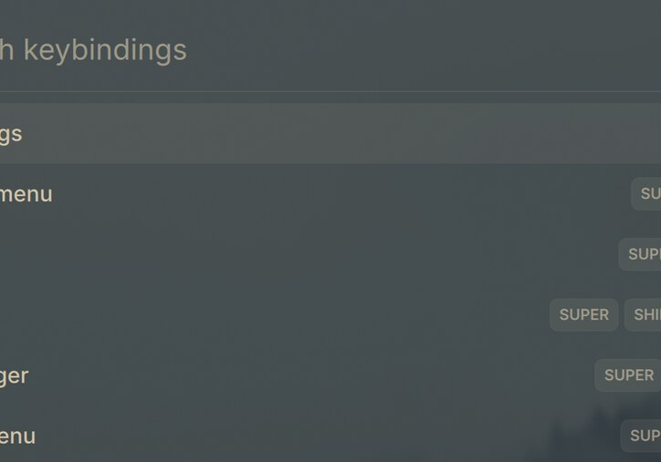</td>
  </tr>
  <tr>
    <td colspan="2" align="center"><strong>Clipboard history</strong><br>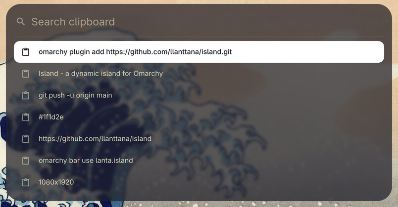</td>
  </tr>
</table>

### Shelf

<table>
  <tr>
    <td align="center">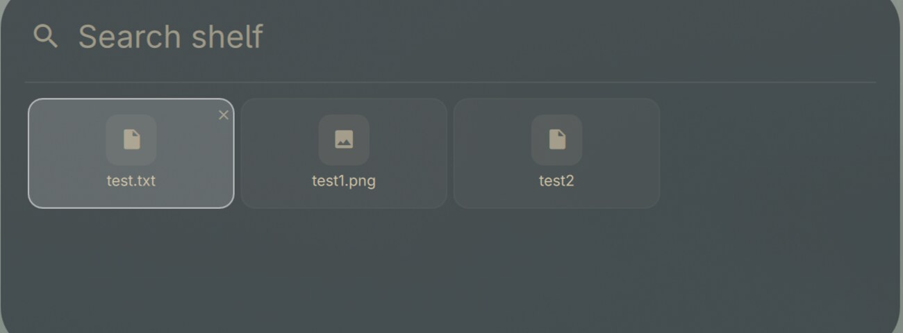</td>
  </tr>
</table>

### Personalization

<table>
  <tr>
    <td width="33%" align="center"><strong>Themes</strong><br>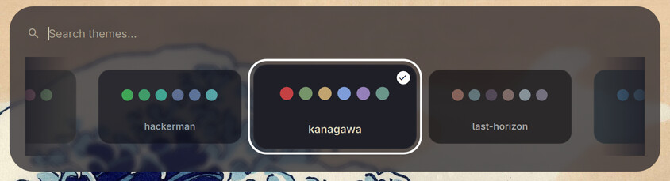</td>
    <td width="33%" align="center"><strong>Wallpapers</strong><br>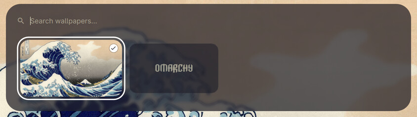</td>
    <td width="33%" align="center"><strong>Power</strong><br>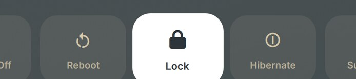</td>
  </tr>
  <tr>
    <td colspan="3" align="center"><strong>Settings</strong><br>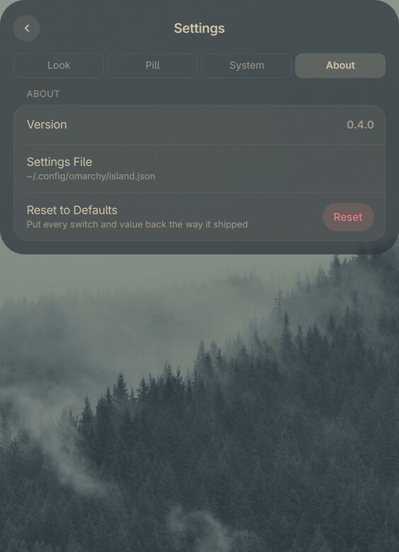</td>
  </tr>
</table>

## Requirements

- Omarchy 4 (Quattro) with its Quickshell-based `omarchy-shell`.
- The notification companion (`lanta.notifications`). It ships in `companion/`
  and the setup pill installs it on first launch.
- PipeWire, for the timer chime and the volume and microphone controls; Omarchy
  ships it.
- Optional, for Ask AI: [Claude Code](https://claude.com/claude-code) or
  [Codex CLI](https://github.com/openai/codex), signed in.
- Wi-Fi, Bluetooth, power profiles, brightness and the night light all use
  Omarchy's own helpers and the running system services.

## Install

Requires Omarchy 4 and its Quickshell shell.

```sh
omarchy plugin add https://github.com/llanttana/island.git
omarchy bar use lanta.island
```

On first launch, click the amber **Set up notifications** pill. It installs
Island's notification companion, connects supported Omarchy menu entries, and
restarts the shell.

## Usage

### Controls

| Action | Result |
| --- | --- |
| Click the clock | Open the control center. |
| Click album art or the sound wave | Open the player. |
| Click the Wi-Fi or Bluetooth tile | Open its page. |
| Click a notification | Open the app (or chat) it came from. |
| Click a download, update or timer | Open the file, or the timer. |
| Click the copied pill | Open the clipboard history. |
| Tap Super | Open the control center, or close the island. |
| Press Esc | Go back one view; from the control center it returns to the pill. |
| Click outside the island | Close the open view. |
| Super + Shift + Space | Hide or show the pill (notifications and views still appear). |

The brightness keys and the touchpad keys draw their feedback through the
island, so the HUD matches the rest of the pill.

### Shelf

Park files, links and text on the island until you clear them or the shell
restarts.

**Putting things on it.** Drag a file, link or text from any app onto the island
and it lands on the shelf; hover the resting pill for a moment and it expands
into the shelf first, so the target is a big one. You can also park the current
clipboard with `omarchy-shell lanta.island shelfAdd` (bind it to a key if you
like); a clipboard-history row has its own shelf button, and `Ctrl+S` does the
same for the selected row.

**Taking things out.** Click a tile to copy it back — an image returns as an
image, a file as a file — or drag it straight into another app. `Ctrl+click`
tiles into a selection, and a drag, copy or remove then covers all of them. If
an app will not take the island's own drag,
[`ripdrag`](https://aur.archlinux.org/packages/ripdrag) can: install it and the
tile menu grows a **Drag out…** entry.

**The tile menu.** Right click a tile for Copy, Open, Remove from shelf and
Clear shelf — and, for text, **Save as .txt** (it writes to `~/Downloads`).

The shelf is kept in memory, so a shell restart or reboot empties it.
`omarchy-shell lanta.island shelf` toggles the view and `... shelfClear` empties
it.

### Customizing the tiles

The four quick tiles in the control center are yours to arrange: drag a tile
onto another slot to move it there, and drag its right edge out to make it wide
(back in to make it narrow). The layout is saved to
`~/.config/omarchy/island.json` as `tileOrder` and `tileWide`.

### Settings

Open the control center and click the gear. The pane is split into **Look**,
**Pill**, **System** and **About** tabs — click one or press ←/→. Changes apply
right away and are saved to `~/.config/omarchy/island.json`, which you can also
edit by hand. **Look → Solid Black** drops the frosted glass for an opaque black
pill with white ink; **System → Keep Shelf** restores parked shelf items after a
shell restart.

### Ask AI

Questions typed in the launcher are answered by the AI chosen under **Ask With**
in Settings, through its command-line tool:

- **Claude:** [Claude Code](https://claude.com/claude-code), signed in (`claude`).
- **Codex:** [Codex CLI](https://github.com/openai/codex), signed in (`codex`).

Choose **None** to turn asking and all AI features off.

## Uninstall

```sh
bash ~/.config/omarchy/plugins/lanta.island/companion/uninstall.sh
```

It switches back to the stock bar, removes the notification companion (Omarchy's
own notifications come back), undoes the `shell.json` and Omarchy menu changes
the setup made, removes Island, and restarts the shell. Backups of both config
files are kept next to them, and your settings stay in
`~/.config/omarchy/island.json`. Add `--dry-run` to see what it would change
first. Keybindings you pointed at Island yourself are listed, not changed.

## Credits

Island is a fork of [Guilherme Pimenta's Island](https://github.com/Guilhermerisu/island),
heavily modified and used under the MIT license. The original copyright notice
is kept in [LICENSE](LICENSE).

## License

[MIT](LICENSE) — original work © 2026 Guilherme Pimenta; modifications © 2026 lanta.
